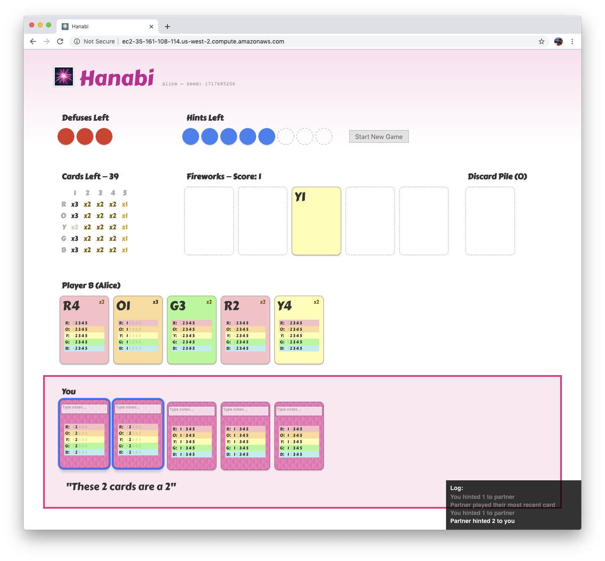

# Cooperative Search in Hanabi (SPARTA)

This repository implements [Search in Cooperative Partially-Observable Games](https://arxiv.org/abs/1912.02318), presented at AAAI 2020, that can be run on top of either heuristic policies, or RL policies based on the [Simplified Action Decoder](https://arxiv.org/abs/1912.02288) (SAD).

In addition to evaluation code for the different agents, this repository also
contains a web server with a Hanabi user-interface, that can be used to play live Hanabi
games with the various Hanabi agents.

The Hanabi Server and heuristic agents used in this work is forked from The [Hanabi](https://github.com/Quuxplusone/Hanabi) project developed by
Arthur O'Dwyer.

Code for training the Simplified Action Decoder (SAD), which achieves state-of-the-art for RL policies and are used as blueprint policies for SPARTA, is provided in the [Hanabi SAD](https://github.com/facebookresearch/Hanabi_SAD) repository.

To reference this work, please use:

```tex
@inproceedings{lerer2020improving,
  title={Improving Policies via Search in Cooperative Partially Observable Games},
  author={Lerer, Adam and Hu, Hengyuan and Foerster, Jakob and Brown, Noam},
  booktitle={AAAI Conference on Artificial Intelligence},
  year={2020},
}
```

---

## Requirements
* Python3
* PyTorch 1.2+
* Boost 1.69+

**For SAD blueprint only**
* libtorch, CUDA

### ***Note**: We also provide the option of a Docker installation. For this, you only need Docker installed (or Docker + CUDA 10.0 if running SAD blueprint)*

---

## Getting Started

### Installation (without Docker)
1. Make sure you have the requirements installed.
2. If you plan to use the SAD blueprint agent, you need a CUDA GPU and will need to install [libtorch](https://pytorch.org/cppdocs/installing.html) with CUDA support.
3. Clone the repo

```bash
git clone https://github.com/facebookresearch/Hanabi_SPARTA
cd Hanabi_SPARTA
```

4. Install the library
```bash
# CPU only: heuristica agents only; does not support SAD agents/blueprints
python setup.py install

# GPU enabled: supports heuristic *and* SAD agents/blueprints
INSTALL_TORCHBOT=1 python setup.py install
./download_models.sh  # download the SAD models!
```

### Installation (with Docker)

First, build the image:

```bash
docker build -t hanabi .
```

Then run the image, in either a GPU or CPU context:

```bash
# with GPU:

nvidia-docker run -it --rm --runtime=nvidia hanabi bash

# with CPU:

docker run -it --rm hanabi bash
```

---

## Use Case #1: Evaluating agents

```bash
# evaluate SmartBot for two players (1000 games)
python eval_bot.py SmartBot --games 1000

# evaluate SAD for two players (1000 games)
GREEDY_ACTION=1 TORCHBOT_MODEL=models/sad_player2.pth python eval_bot.py TorchBot --games 1000

# evaluate SAD for three players (1000 games)
GREEDY_ACTION=1 TORCHBOT_MODEL=models/sad_player3.pth python eval_bot.py TorchBot --games 1000 --players 3

# evaluate single-agent search with SmartBot blueprint
BPBOT=SmartBot python eval_bot.py SearchBot --games 10

# evaluate multi-agent search with SmartBot blueprint
BPBOT=SmartBot python eval_bot.py JointSearchBot --games 1

# evaluate single-agent search with SAD blueprint
GREEDY_ACTION=1 TORCHBOT_MODEL=models/sad_player2.pth python eval_bot.py SearchBot

```

## Use Case #2: Playing Hanabi with SPARTA Agents Through a web interface



### Get Started

To run the game using a web interface, we need to start 2 servers:
- Frontend server: hosts the front-end web interface
- Backend server: runs the game server on port 5000 and provides an API for the front-end interface to consume (the back-end server can be started either locally or through the Docker image)

#### Frontend server:
```bash
cd webapp
yarn         # to install all package dependencies, or: npm install
yarn start   # to run the server in development mode, or: npm run start
```

#### Backend server:
Option 1 - Run locally:
```bash
BOT=SmartBot python webapp/server.py
# ...or replace SmartBot with a different bot, e.g. BOT=TorchBot
```

Option 2 - Run server through Docker:
```bash
# This runs TorchBot by default, see Dockerfile for all the default config settings:
# (Note: we use nvidia-docker and the --runtime flag here because TorchBot needs a GPU)

nvidia-docker run -it --rm --runtime=nvidia hanabi

# ...or you can override env vars such as BOT to modify e.g. which bot to start
# the game with:

docker run -it --rm -e BOT=SmartBot hanabi
```

Note that the above commands are similar to the Docker commands for running a bash shell in the Getting Started section above, except these leave out the `bash` command at the end. This is because not specifying `bash` falls back to using the default command provided in the `Dockerfile` with the `CMD` keyword, which is set to default to starting the backend server. More information about the `CMD` keyword and how specifying `bash` overrides it can be found [here](https://docs.docker.com/engine/reference/run/#cmd-default-command-or-options).

#### UI Development

The Hanabi webapp is scaffolded using [create-react-app](https://github.com/facebook/create-react-app).
The code is architected using global state (e.g. see `State.js` and `BoardState.js` in `/webapp/src/`), which is provided by the back-end server. The reducer pattern is used to manage this global state. The front-end connects to the backend over the websocket protocol.


## Contributing

See the [CONTRIBUTING](CONTRIBUTING.md) file for how to help out.

## License
This repository is CC-by-NC licensed, as found in the LICENSE file.
